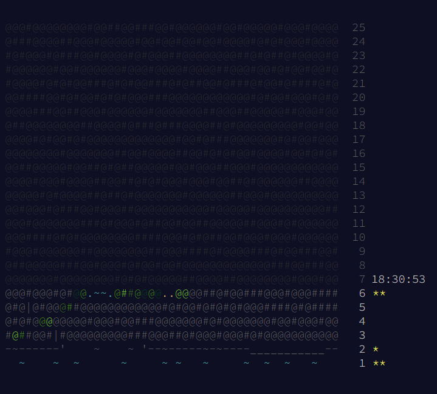
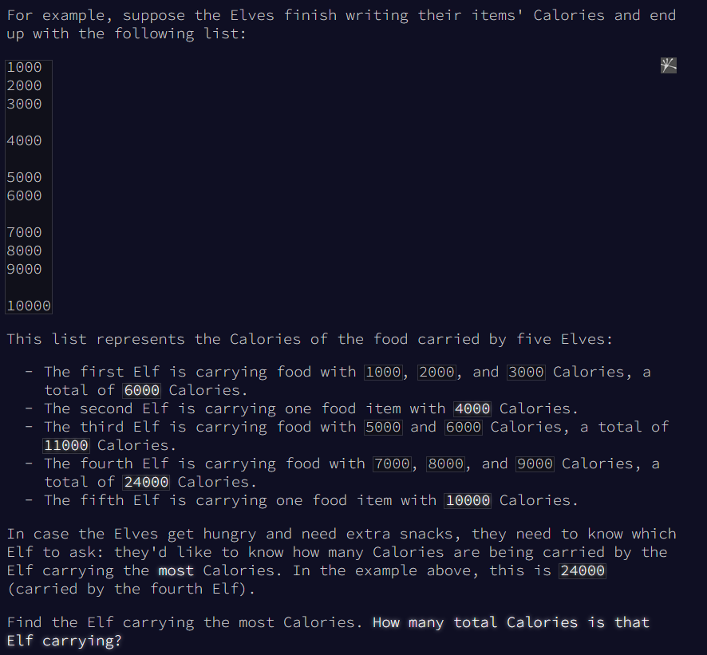

Wah Advent of Code akhirnya kembali lagi, apaan sih Advent of Code? 

## Apa itu Advent of Code?

Jadi Advent of Code adalah sebuah teka teki pemrograman komputer yang diadakan setiap tahunnya. Di sini, kita akan diberikan sebuah permasalahan dan kita harus menyelesaikannya dengan menggunakan algoritma yang tepat. Biasanya, kita akan diberikan sebuah input dan kita harus mengeluarkan sebuah output yang sesuai dengan permasalahan yang diberikan.

## Siapa sih pendirinya?
Kalo kata [Wikipedia](https://en.wikipedia.org/wiki/Advent_of_Code), Advent of Code adalah sebuah acara tahunan yang diadakan oleh [Eric Wastl](https://twitter.com/ericwastl) yang berisi 25 hari teka teki pemrograman komputer. Acara ini diadakan saat menjelang hari natal.

## Gimana nih kalo mau ikut main?

1. Pertama tama, kamu bisa banget daftar ke [Advent of Code](https://adventofcode.com/2022) pake akun google, github, ataupun twitter.
2. Setelah itu kamu akan mendapatkan tampilan halaman seperti ini

Di bagian ini kamu bisa melihat dari bawah **(nomor 1) sampai atas (nomor 25)** yang merupakan hari terakhir dari acara ini. Nomor ini adalah nomor dari permasalahan yang akan diberikan setiap harinya sesuai dengan tanggal, jadi kalau sudah tanggal **10 desember** maka kamu baru bisa mengerjakan **permasalahan nomor 10**.

3. Setelah itu kamu bisa klik **nomor 1** untuk memulai mengerjakan permasalahan nomor 1. Setelah itu kamu akan mendapatkan tampilan seperti ini

Well, nantinya kamu akan diberikan jalan cerita yang akan membantu kamu untuk menyelesaikan permasalahan tersebut. Setelah itu akan diberikan contoh input dan output yang akan kamu dapatkan jika kamu menyelesaikan permasalahan tersebut. Setelah itu kamu ditantang untuk menyelesaikan permasalahan tersebut dengan menggunakan bahasa pemrograman yang kamu kuasai.

4. Setelah kamu menyelesaikan permasalahan tersebut, kamu bisa klik **Submit** untuk mengirimkan jawaban kamu. 

## Gimana nih kalau mau ikutan leaderboard?
Kamu bisa ikutan leaderboard dengan cara klik **Leaderboard** di bagian atas halaman utama. Setelah itu klik bagian **Private Leaderboard** dan masukkan kode **`2238062-3ba1a0bb`** atau bisa langsung ke [Leaderboard](https://adventofcode.com/2022/leaderboard/private) untuk masuk ke [leaderboard cp-wri](https://cp-wri.github.io/aoc/). Setelah itu kamu bisa lihat leaderboard yang sudah kami buat.

So, gimana nih? Apakah kamu tertarik untuk ikut main? Yuk ikutan main dan berkontribusi di [Advent of Code 2022](https://adventofcode.com/2022)! Oh iya jangan lupa untuk join ke [cp-wri](https://cp-wri.github.io/) kalo kamu mau belajar bareng seputar competitive programming.